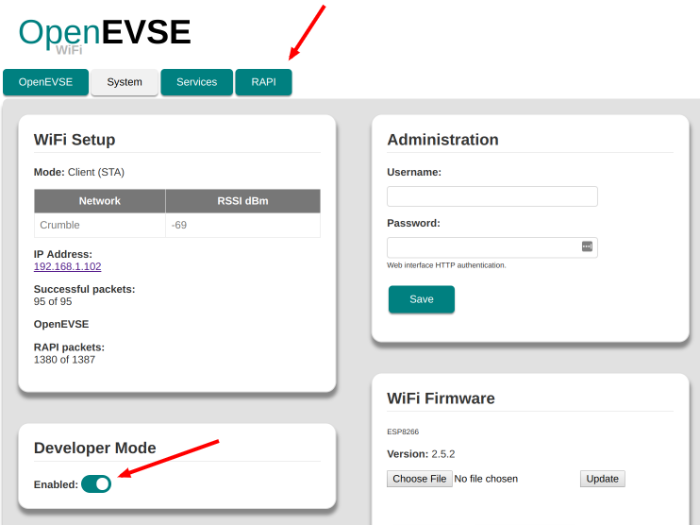
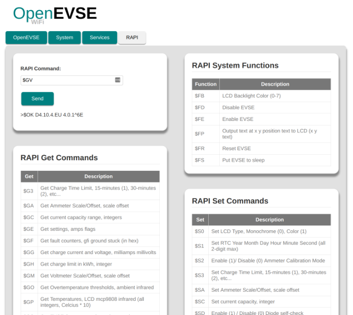

# RAPI API

> **IMPORTANT**: It is no longer recommended to use RAPI API if EVSE also had a WiFi module fitted, since use of the RAPI API will conflict with the WiFi module, instead the HTTP API should be used to control the WiFi module instead of the controller via RAPI.
>
> User RAPI will be removed in a future version of the firmware or at least limited to `$Gx` commands

RAPI commands can be used to control and check the status of all OpenEVSE functions. RAPI commands can be issued via the direct serial, web-interface, HTTP and MQTT. We recommend using RAPI over MQTT.

A full list of RAPI commands can be found in the [OpenEVSE plus source code](https://github.com/OpenEVSE/open_evse/blob/stable/firmware/open_evse/src/rapi_proc.h).

## RAPI via web interface

Enter RAPI commands directly into to web interface (dev mode must be enabled), RAPI response is printed in return:





## RAPI over MQTT

RAPI commands can be issued via MQTT messages. The RAPI command should be published to the following MQTT:

```text
<base-topic>/rapi/in/<$ rapi-command> payload
```

e.g assuming base-topic of `openevse` the following command will set current to 13A:

```text
openevse/rapi/in/$SC 13
```

The payload can be left blank if the RAPI command does not require a payload e.g.

```text
openevse/rapi/in/$GC`
```

The response from the RAPI command is published by the OpenEVSE back to the same sub-topic and can be received by subscribing to:

```text
<base-topic>/rapi/out/#`
```

e.g. `$OK`

[See video demo of RAPI over MQTT](https://www.youtube.com/watch?v=tjCmPpNl-sA&t=101s)

## RAPI over HTTP

RAPI (rapid API) commands can also be issued directly via a single HTTP request.

Using RAPI commands should be avoided if possible. WiFi server API is preferable. If RAPI must be used, avoid fast polling.

*Assuming `192.168.0.108` is the local IP address of the OpenEVSE ESP.*

Eg.the RAPI command to set charging rate to 13A:

[http://192.168.0.108/r?rapi=%24SC+13](http://192.168.0.108/r?rapi=%24SC+13)

To sleep (pause a charge) issue RAPI command `$FS`

[http://192.168.0.108/r?rapi=%24FS](http://192.168.0.108/r?rapi=%24FS)

To enable (start / resume a charge) issue RAPI command `$FE`

[http://192.168.0.108/r?rapi=%24FE](http://192.168.0.108/r?rapi=%24FE)

## Libraries

Libraries are avalible in a few different languages to provide easy access to RAPI:

- [Python](https://github.com/tiramiseb/python-openevse)
- [Node](https://github.com/OpenEVSE/node-openevse)
- [Arduino](https://github.com/jeremypoulter/OpenEVSE_Lib)
